

  <h1>8 Rooks Solver ♖</h1>
  
Trò chơi giải đố 8-puzzle với nhiều nhóm thuật toán tìm kiếm AI

---
## Sinh viên thực hiện:
| Họ và tên                   | MSSV       |
|-----------------------------|------------|
| Trương Hoài Chương          | 23110081   |

---

# Báo cáo bài tập cá nhân 8 Rooks Solver
## 1. Mục tiêu
  - Xây dựng chương trình sử dụng các thuật toán tìm kiếm AI đặt 8 quân xe vào bàn cờ 8x8 theo quy tắc không có cặp quân nào xung đột lẫn nhau.
  - Dự án tập trung vào khả năng tìm kiếm lời giải và trực quan hóa quá trình tìm kiếm lên giao diện, mô phỏng cách thuật toán làm việc trên không gian ma trận 8x8.

## 2. Nội dung
### 2.1. Nhóm thuật toán tìm kiếm không có thông tin
#### a) BFS
- **Mô tả**: 
  - Thuật toán `BFS` mở rộng theo từng `row`, tạo tất cả trạng thái ở `row` hiện tại đang xét.
  - Khi đặt hết `quân xe` vào `8` cột ở `row` thì đi xuống `row + 1` và duyệt qua toàn bộ không gian trạng thái từ các trạng thái đã được tạo từ trước (`row`).
  - Lặp lại cho đến khi đặt đủ `8 quân xe` vào bàn cờ và thỏa mãn điều kiện không quân nào xung đột lẫn nhau.

- **Minh họa**:

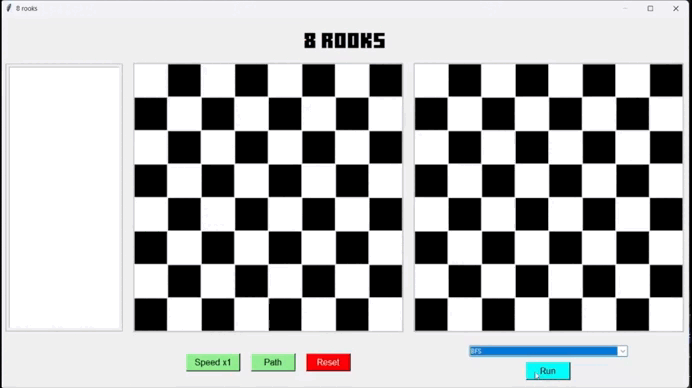

#### b) DFS
- **Mô tả**:
  - Thuật toán DFS duyệt qua các không gian trạng thái theo chiều sâu, xét thẳng lần lượt các nhánh từ `row = 0` đến `row = 7`, mỗi lần tạo không gian trạng thái (đặt 1 `quân xe` vào `row`) đều tránh các cột mà làm cho `quân xe` chuẩn bị đặt xung đột với các `quân` đã đặt.
  - Khi đặt đủ `8 quân xe` và không có cặp `quân` nào xung đột với nhau thì dừng thuật toán.

- **Minh họa**:

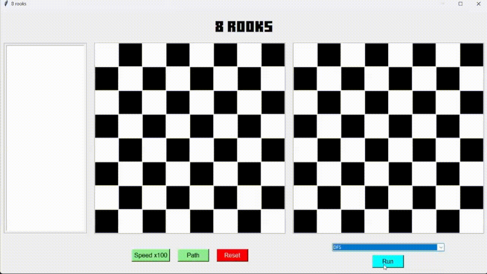

#### c) UCS
- **Mô tả**:
  - Thuật toán `UCS` duyệt theo từng `row` và sử dụng cấu trúc dữ liệu hàng đợi ưu tiên (`priority queue`) để ưu tiên trạng thái có chi phí đường đi hiện tại (`g(n)`) thấp nhất.
  - `g(n)` là chi phí được tính từ `trạng thái ban đầu` đến `trạng thái hiện tại đang xét`, mỗi lần đặt 1 `quân xe` thì chi phí của `trạng thái hiện tại` tăng 1.
  - **Ý tưởng**:
    - Từ hàng đợi `priority queue` lấy ra trạng thái `path` có `g(n)` thấp nhất.
    - Mở rộng `path` bằng cách đặt thêm 1 quân xe vào nó với điều kiện không xung đột với các quân đã đặt trong `path`, tính lại `g(path)` và thêm vào `priority queue`.
    - Nếu `path` đặt đủ 8 quân xe thì trả về và dừng thuật toán. 

- **Minh họa**:

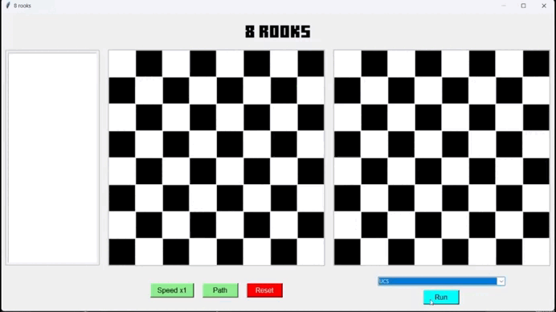

#### d) DLS
- **Mô tả**:
  - Thuật toán `DLS` là phiên bản cải tiến của `DFS`, cũng sử dụng phương pháp duyệt theo chiều sâu (từ `row = 0` đến `row = limit`).
  - `DLS` được triển khai bằng cách giới hạn lại độ sâu (`limit`) của việc tìm kiếm trên 1 nhánh của cây tìm kiếm. Mục đích tối ưu lời giải tìm được.
  - Phương pháp duyệt của `DLS` giống `DFS`, mở rộng không gian trạng thái theo chiều sâu (từ `row = 0` xét thẳng đến `row = limit`, mỗi row đặt 1 `quân xe` với điều kiện không xung đột với các `quân` đã đặt).
  - Khi row > limit thì `cutoff`, bỏ nhánh đang xét và chuyển sang nhánh tiếp theo (đặt lại 1 quân xe đã đặt ở `col` khác)
  - Nếu đã đặt đủ `8 quân xe` đúng với yêu cầu đề bài thì dừng thuật toán và trả về lời giải tìm được.

- **Minh họa**:

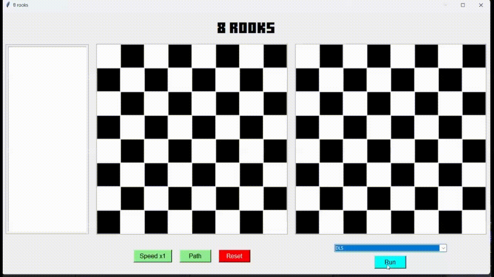

#### e) IDS
- **Mô tả**:
  - `IDS` là phiên bản kết hợp các ưu điểm của `BFS` và `DFS`, tối ưu lời giải tìm được và tốn ít bộ nhớ.
  - `IDS` là việc lặp lại thuật toán tìm kiếm `IDS` với độ sâu giới hạn tăng dần (`depth_limit = 1, 2, 3...`).

- **Minh họa**:

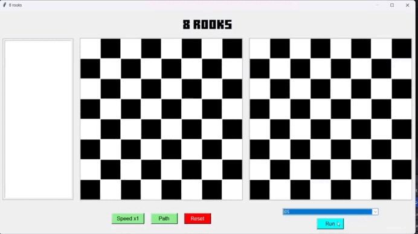

### 2.2. Nhóm thuật toán tìm kiếm có thông tin
#### a) Greedy
- **Mô tả**:
  - Thuật toán `greedy` sử dụng cấu trúc dữ liệu `priority queue`, ưu tiên xét trạng thái có chi phí ước lượng (`heuristic h(n)`) thấp nhất.
  - Chi phí ước lượng `heuristic` được tính bằng công thức `h(n) = (n - row đã đặt) + (n - col đã đặt)`.
  - Tại mỗi trạng thái đang xét, `greedy` sinh trạng thái bằng cách đặt các quân xe vào `row + 1` và các `col` (không được xung đột với các quân đã đặt trong trạng thái đang xét), tính lại chi phí `heuristic` và thêm trạng thái được sinh ra và chi phí của nó vào `priority queue`. 
  - Lặp lại giữa việc lấy trạng thái trong `priority queue` (trong bài toán 8 quân xe, mỗi trạng thái có số lượng `quân xe` bằng nhau đều có `h(n)` bằng nhau), nên greedy có thể lấy bất kỳ trạng thái nào trong đó. 

- **Minh họa**:

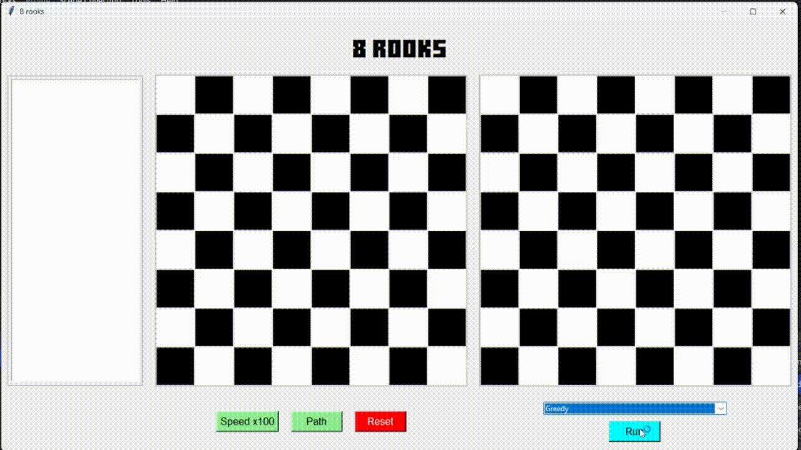

#### b) A*
- **Mô tả**:
  - `A*` là thuật toán tìm kiếm dựa trên tổng của chi phí thực tế và chi phí ước lượng `(f(n) = g(n) + h(n))` để tìm lời giải tối ưu nhất.
  - Thuật toán sử dụng hàng đợi ưu tiên `priority queue` dựa trên chi phí `f(n)`.
  - Ở mỗi trạng thái đang xét, `A*` sinh trạng thái mới bằng cách đặt thêm 1 `quân xe` vào `row + 1` sao cho không xung đột với các `quân` đã đặt. Tính toán `f(n)` và thêm vào `priority queue`.
  - Tiếp tục lấy trạng thái từ `priority queue` (ưu tiên trạng thái có `f(n)` nhỏ nhất) và tiếp tục sinh trạng thái ở `row` tiếp theo.
  - Khi đặt đủ `8 quân xe` thì trả về lời giải tìm được và dừng thuật toán. 

- **Minh họa**:

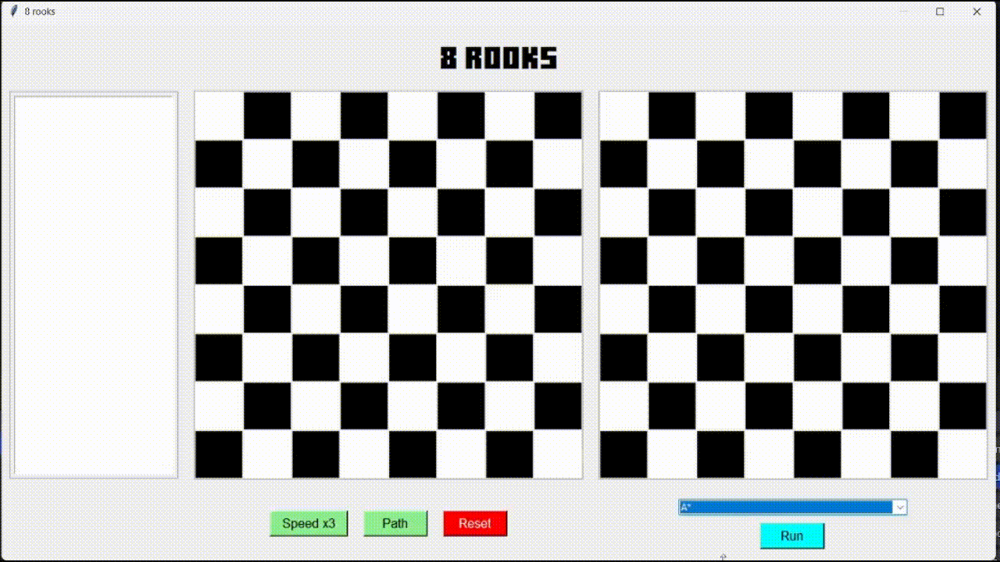

### 2.3. Nhóm thuật toán tìm kiếm cục bộ
#### a) Hill CLimbing
- **Mô tả**:
  - Thuật toán `Hill Climbing` tìm kiếm lời giải bằng việc tối ưu lời giải từng bước dựa trên **`độ tốt`** của mỗi trạng thái.
  - Trong bài toán `8 quân xe`, thuật toán đặt lần lượt 1 quân xe vào các `col` mà có thể đặt được, sau đó tính toán chi phí (`costConflict`).
  - Sau khi đặt hết quân xe vào các `col` của trạng thái đang xét, lựa chọn `col` có `costConflict` thấp nhất và **chính thức** đặt quân xe vào `col` đã chọn.
  - Lặp lại cho đến khi đặt đủ `8 quân xe`.

- **Minh họa**:

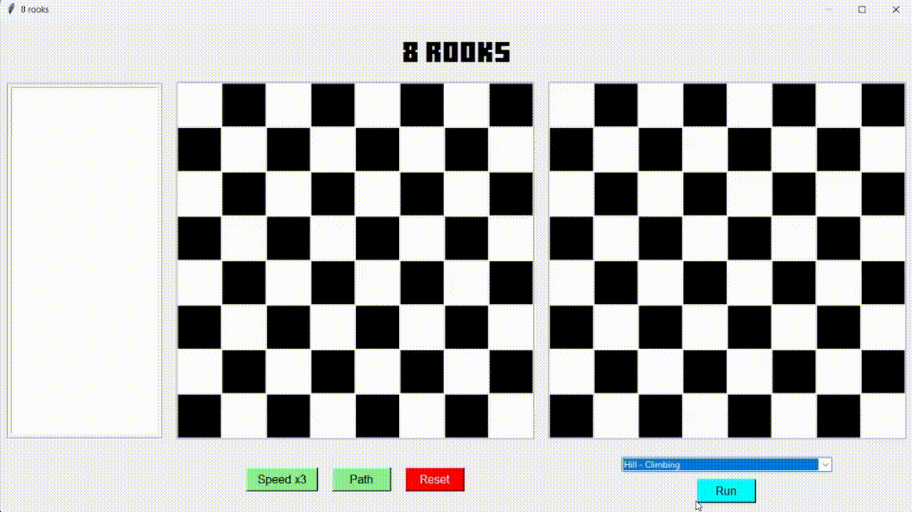

#### b) Simulated annealing
- **Mô tả**:
  - `Simulated annealing` là cải tiến của `hill climbing`, cho phép thuật toán thoát khỏi `cực trị địa phương` và **có khả năng** tìm được `cực trị toàn cục`.
  - Trong bài toán, `Simulated annealing` khởi tạo trạng thái ban đâu là đầy đủ `8 quân xe` được đặt vị trí ngẫu nhiên trên bàn cờ, và tính chi phí xung đột ban đầu (`cost`).
  - Trong mỗi vòng lặp, thuật toán sinh trạng thái (`child`) bằng cách chọn ngẫu nhiên `1 quân xe` và di chuyển ngẫu nhiên sang `cột` khác.
  - Tính **`delta =  child_cost - cost`**:
    - Nếu **`delta <= 0`** (`child tốt hơn hoặc bằng`): Chấp nhận `child` ngay.
    - Nếu **`delta > 0`** (`child xấu hơn`): xem xét có chấp nhận hay không dựa trên xác suất ngẫu nhiên (`exp(-delta / T)`).
  - Cuối mỗi vòng lặp, giảm dần nhiệt độ `T` với hệ số `alpha`.
  - Nếu trong quá trình lặp mà có trạng thái có `cost = 0` thì trả về lời giải tìm được và dừng thuật toán.

- **Minh họa**:

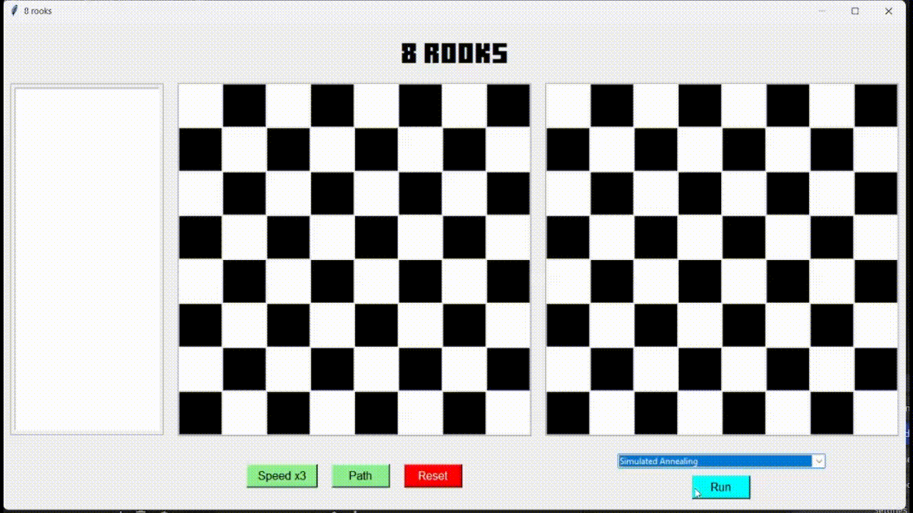

#### c) Genetic
- **Mô tả**:
  - Thuật toán `genetic` được triển khai mô phỏng theo sự lai ghép và đột biến của cá thể.
  - Thuật toán khởi tạo trạng thái ban đầu `population` gồm có `pop_size` cá thể ngẫu nhiên.
  - Thực hiện quá trình tiến hóa quần thể (tối đa tiến hóa đến thế hệ `generations`):
    - Tại mỗi thế hệ, chọn ra cá thể tốt nhất `best`, tính chi phí xung đột `costConflict` và kiểm tra nếu `costConflict = 0` thì trả về `best` và dừng thuật toán.
    - Triển khai việc tạo thế hệ mới `new_pop` (số lượng cá thể `~ pop_size`):
      - Chọn ngẫu nhiên 2 cá thế cha `p1, p2` từ quần thể `population`.
      - Lai ghép 2 cá thể `p1, p2` bằng cách ngẫu nhiên ghép phần đầu và cuối của `p1, p2` lại với nhau, tạo thành 2 cá thể con `c1, c2`.
      - Với xác suất `mutate_rate`, một số gen trong `c1, c2` có thể đột biến (vị trí 1 vài `quân xe` có thể thay đổi ngẫu nhiên).
    - Quần thể `population` ban đầu tiến hóa thành `new_pop` và quay lại vòng lặp để tạo thế hệ mới.

- **Minh họa**:

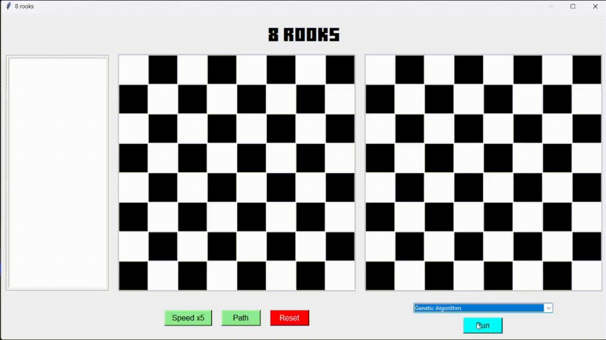

#### d) Beam
- **Mô tả**:
  - Thuật toán `beam` sử dụng phương pháp mở rộng giống `BFS`, nhưng chỉ giữ lại `k` trạng thái tốt nhất. Giảm đáng kế không gian và thời gian tìm kiếm.
  - Trạng thái ban đầu (`beam`) gồm `k` trạng thái ngẫu nhiên (có đầy đủ `8 quân xe`) và tính chi phí xung đột (`costConflict`) tương ứng cho mỗi trạng thái. 
  - Trong vòng lặp, thuật toán kiểm tra từng trạng thái trong `beam`, sinh trạng thái con (`neighbor`) bằng cách di chuyển quân xe sang các `col` khác trên cùng 1 `row` và tính `costConflict` cho mỗi `neighbor`.
  - Sau khi sinh tất cả `neighbor`, cập nhật `beam` thành `k` trạng thái tốt nhất trong `neighbor`.
  - Nếu trong vòng lặp kiểm tra thấy trạng thái nào có `costConflict = 0` thì trả về lời giải và dừng thuật toán.
- **Minh họa**:

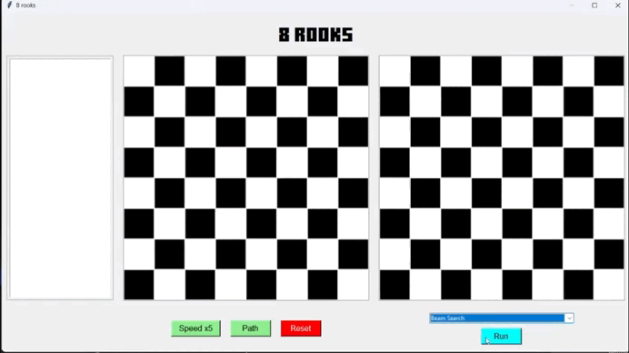

### 2.4. Nhóm thuật toán tìm kiếm trong môi trường phức tạp
#### a) And-Or tree search
- **Mô tả**:
  - Thuật toán `And–Or Tree Search` là một dạng thuật toán tìm kiếm theo cây logic, được sử dụng phổ biến trong các dạng bài toán có cấu trúc hoặc phân nhánh điều kiện.
  - Trong bài toán `8 quân xe`, thuật toán `And–Or Tree Search` được sử dụng như một dạng mở rộng của DFS có cấu trúc logic, giúp tìm ra kế hoạch (`plan`) để đặt đầy đủ `8 quân xe` sao cho không có cặp quân nào xung đột lẫn nhau. 
  - Thuật toán được xây dựng dựa trên hai loại nút chính:
    - **Nút OR**: Biễu diễn các lựa chọn có thể (đặt quân xe vào bất kỳ cột trống nào đó tại mỗi hàng).
    - **Nút AND**: Biểu diễn các điều kiện đồng thời phải thỏa mãn (mọi bước con đều phải thỏa điều kiện của bài toán `8 quân xe` để tiếp tục lên kế hoạch).
    - **Cụ thể**:
      - `or_search` duyệt qua các lựa chọn: với mỗi cột còn trống (`free_col`), sinh ra trạng thái con (`child`) tại cột này và gọi `and_search` để kiểm tra tính khả thi của kế hoạch tại điểm này.
      - `and_search` kiểm tra toàn bộ các trạng thái con (`child`). Nếu tất cả đều hợp lệ → trả về danh sách `plan` tương ứng đã tạo. Ngược lại nếu có bất kỳ `child` nào thất bại, nhánh đang xét hiện tại bị loại bỏ.

- **Minh họa**:

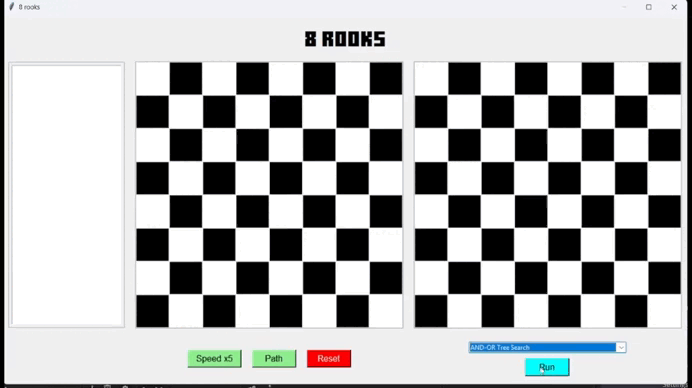

#### b) Belief state
- **Mô tả**:
  - `Trạng thái niềm tin` (`belief state`) là không gian trạng thái mà trong đó, `agent` không biết bản thân đang ở đâu. Phải thực hiện mở rộng với trạng thái ban đầu là tập các niềm tin mà `agent` nghĩ rằng bản thân đang ở đó. 
  - Trong bài toán `8 quân xe`, thuật toán khởi tạo trạng thái ban đầu bằng với số lượng trạng thái ngẫu nhiên, trong mỗi trạng thái được đặt sẵn số lượng `quân xe` ngẫu nhiên tại vị trí ngẫu nhiên.
  - Sau đó lọc bỏ các trạng thái có xuất hiện `xung đột`.
  - Trong vòng lặp tìm kiếm, thuật toán duyệt qua toàn bộ trạng thái trong không gian ban đầu, chọn `col` bất kỳ còn trống và đặt quân xe vào `col` trống đó. 
  - Trong quá trình tìm kiếm, nếu xuất hiện trạng thái có đủ số lượng `quân xe` thì trả về lời giải và dừng thuật toán.

- **Minh họa**:

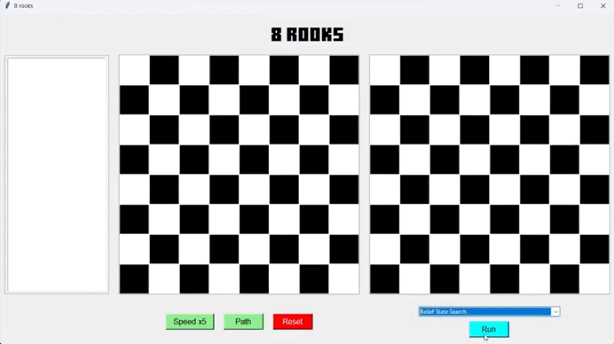

#### c) Partially Observable Search
- **Mô tả**:
  - `Partially Observable Search (POS)` là không gian trạng thái mà trong đó, `agent` chỉ thấy được một phần hướng đi đúng đẵn của lời giải.
  - Trong bài toán, khởi tạo không gian trạng thái ban đầu được đặt ngẫu nhiên một vài `quân xe` mà không gây xung đột trên bàn cờ.
  - `POS` tìm kiếm lời giải bằng cách đặt tiếp các quân xe vào `row`, `col` hợp lệ, gọi sử dụng thuật toán `DFS` để đặt tiếp số quân xe còn lại sao cho không gây xung đột với nhau và với các quân ban đầu đã khởi tạo.

- **Minh họa**:

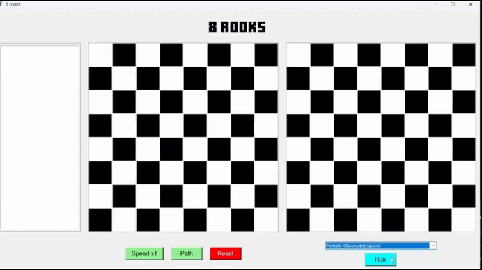

### 2.5. Nhóm thuật toán tìm kiếm thỏa mãn ràng buộc
#### a) Backtracking
- **Mô tả**:
  - `Backtracking` là thuật toán tìm kiếm lời giải dựa trên việc **`quay lui`** tại mỗi trạng thái đang xét.
  - Trong bài toán, `backtracking` hoạt động dựa trên vòng lặp đệ quy giống `DFS`, khi đặt đủ `8 quân xe` mà không thỏa mãn điều kiện, `backtracking` quay lui lại trạng thái lúc ban đầu mới đặt `7 quân xe`, đặt lại quân số 8 vào cột khác và kiểm tra điều kiện.
  - Lặp lại hành động `quay lui` giữa các trạng thái với nhau cho đến khi thỏa mãn điều kiện bài toán.

- **Minh họa**:

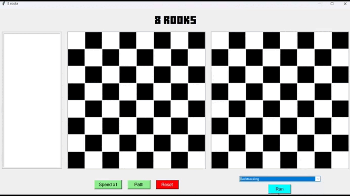

#### b) Forward checking
- **Mô tả**:
  - `Forward checking` là phiên bản cải tiến của `backtracking`, có xử lý phạm vi miền giá trị (`domain`) cho các biến. Giúp giảm bớt không gian tìm kiếm và giảm thời gian chạy.
  - Trong bài toán này, mỗi `row` được xem là một biến, `domain` là các `col` mà tại đó có thể đặt quân xe.
  - Trong vòng lặp đệ quy, mỗi khi đặt một quân xe, thuật toán sẽ cập nhật lại `domain` cho các `row` tiếp theo bằng cách:
    - Mỗi khi đặt 1 quân xe, tại vị trí `(row, col)`, `domain` sẽ cập nhật miền giá trị của mọi `r > row` phía dưới bằng cách xóa col khỏi miền giá trị của `r`.
    - Trong vòng lặp, nếu có bất kỳ `row` nào có `domain` rỗng thì dừng và quay lui lại `row - 1` trước đó.
    - Khi đặt đủ `8 quân xe` thì trả về lời giải và dừng thuật toán.

- **Minh họa**:

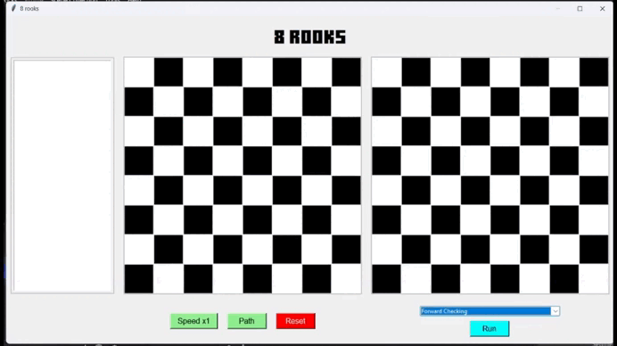

#### c) AC-3
- **Mô tả**:
  - Thuật toán `AC-3` tận dụng tính nhất quán cung để loại bỏ các hướng đi không hợp lệ trước khi tìm kiếm. Giúp giảm kích thước không gian trạng thái và tăng hiệu quả tìm kiếm.
  - Trong bài toán `8 quân xe`, mỗi biến `Xi` tương ứng với một hàng (`row`) và miền giá trị (`domain`) của nó là các cột (`col`) có thể đặt:
    - Không có 2 biến `Xi`, `Xj` nào nhận cùng một giá trị `c` (không có 2 quân xe nào nằm trên cùng một `col`).
  - Trước khi bắt đầu thực hiện tìm kiếm, `AC-3` thực hiện lọc lại `domain` của các `row`, nhưng bài toán này là trường hợp đặc biệt, do ban đầu không chưa có quân xe nào nên `domain` sau khi lọc vẫn như cũ. Do ràng buộc hiện tại là **các quân xe trên mỗi `row` không cùng `col` với biến khác**, và ở trạng thái ban đầu, tất cả các `col` đều còn khả thi nên `AC-3` không thể suy luận logic để loại bỏ phần tử nào cả.
  - Sau khi lọc bớt `domain`, thực hiện tìm kiếm quay lui `backtracking` trên miền vừa được lọc:
    - Đặt từng quân xe tại vị trí `(row, col)` ở mỗi hàng, `col` chỉ được chọn trong `domain[row]`. Vừa đặt vừa đảm bảo các quân được đặt không gây xung đột với các quân khác.
    - Nếu đã đặt đủ `8 quân xe` mà không vi phạm ràng buộc, trả về lời giải và dừng thuật toán.

- **Minh họa**:

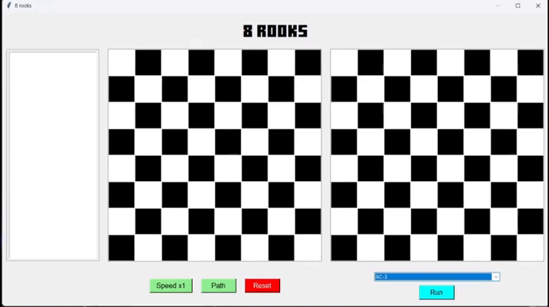